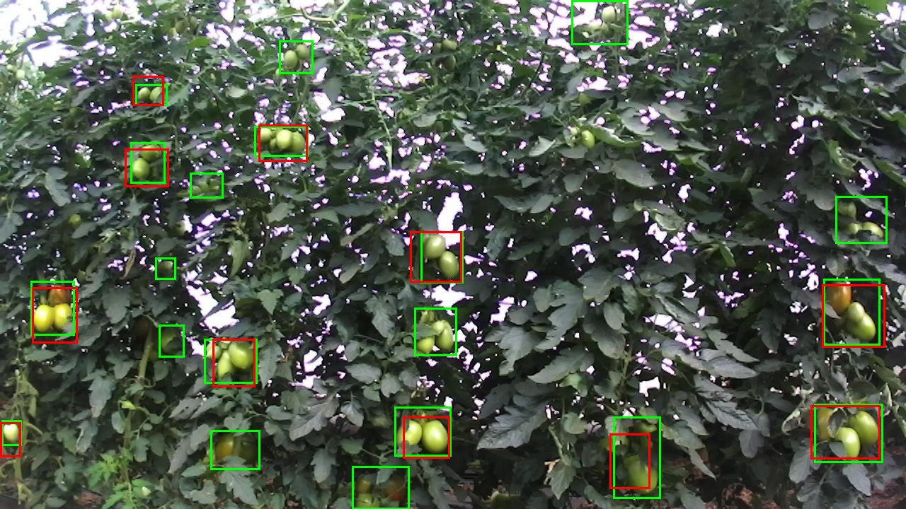
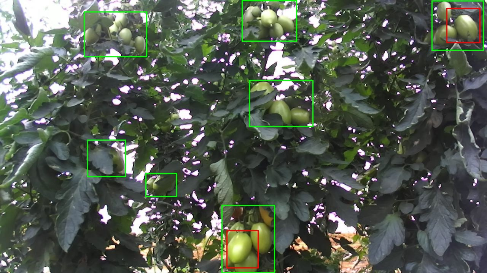
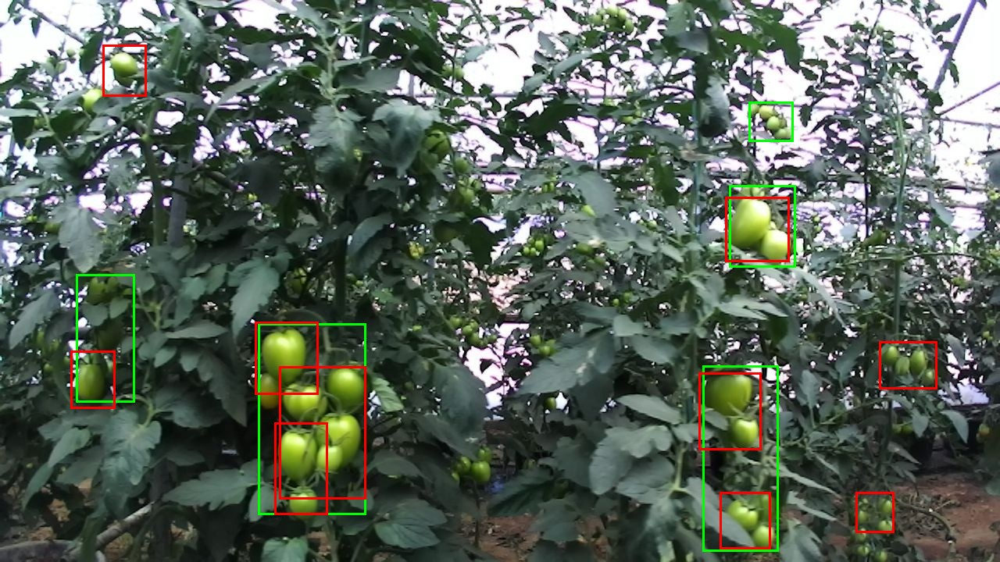

# AgRob visual cluster counting pilot — 9 October 2026

## Team update

> We trained the fruit DETR model to detect our relabeled visual tomato clusters. The supplied subset contains 54 training, 18 validation, and 44 test images. At a confidence threshold of 0.90, selected using validation images before testing, average test count error is 2.34 clusters per image. The model undercounts by 1.52 clusters per image on average. Box precision is 49.7% and recall is 41.0%. Common failures are missed shaded/occluded groups and detections that split a group into smaller boxes. Nearby source video frames cross the supplied splits, so this is a pilot measurement. The next step is to clarify cluster labeling rules and build a separate scene-based test set.

Branch: `experiment/agrob-cluster-count`, based on `5adf07e` from `experiment/agrob-finetune`.

**What is counted:** visually grouped nearby tomatoes that appear to share one stem, matching the annotator's clarification. Stem membership is unverified. These results score supplied cluster boxes. They do not establish individual tomato counts or botanical truss counts. A one-fruit visible group occurs in the supplied labels; the baseline preserves those labels.

## 1. Import and check the labels

Source: `tomato cluster-Folder- JPEGImages- Job 2.coco.zip`, a user-relabeled subset of [AgRobTomato](https://zenodo.org/records/5596799).

Archive SHA256: `87a789733ea150f50f7d9151312396bdbd4d865269f97ddce9d65afd754c0e06`.

| Supplied split | Images | Labeled clusters |
| --- | ---: | ---: |
| Training | 54 | 551 |
| Validation | 18 | 197 |
| Test | 44 | 383 |
| Total | 116 | 1,131 |

The importer checks ZIP paths, annotation IDs, image dimensions, bounding boxes, categories, original filenames, and image hashes. All images are 1280 × 720. No exact image duplication or original filename overlap was found across splits. All boxes were valid. Each split has zero images labeled with zero clusters.

The export's unused parent category `tomato-final` (ID 0) was removed. Annotated `tomato cluster` (ID 1) was mapped to the single model class `tomato_cluster` (ID 0). Box positions and supplied split membership were preserved. Training and validation label contact sheets were inspected before model testing. This was a spot check, not a complete human label audit.

**Split limitation:** there are 42 pairs of source frames, one or two frame numbers apart, assigned to different splits: 23 train/validation, 11 train/test, and 8 validation/test. Consecutive video frames can show the same plants. This is potential scene overlap despite the absence of exact duplicate images. The original image names, hashes, and nearby-frame audit are recorded in [agrob_cluster_manifest.json](agrob_cluster_manifest.json).

Prepared local data: `data/agrob_clusters_v1/images/` and `data/agrob_clusters_v1/annotations/{train,valid,test}.json`.

## 2. Train a cluster detector

The initializer was the original [Fruit Detector DETR-50](https://huggingface.co/MohamedKhayat/fruit-detector-detr-50), pinned to revision `19d09855a284cf040460c1ac39fe994e400cdf47`. Its fruit classification head was replaced with a new one-class cluster head. This run did not initialize from the earlier locally fine-tuned individual-fruit checkpoint. This is standard DETR, separate from RT-DETR.

| Setting | Value |
| --- | --- |
| GPU | NVIDIA RTX 3070, 8 GB |
| Python environment | Existing `.venv-gpu` |
| PyTorch / Transformers | `2.14.1+cu130` / `4.57.6` |
| Epochs / seed | 15 / 42 |
| Input resize | Fit inside 480 × 480, preserving aspect ratio; dynamic padding |
| Batch / gradient accumulation | 1 / 2 |
| Main / backbone learning rate | 0.00005 / 0.00001 |
| Optimizer / weight decay | AdamW / 0.0001 |
| Gradient clipping | 1.0 |
| Augmentation | None |
| Saved checkpoint | Epoch 14, lowest validation loss: 1.373608 |

The existing bounding-box geometry check passed. Training completed all 15 epochs with finite losses. The per-epoch count diagnostic uses threshold 0.30; it is not the final operating threshold. [Training history](results/agrob_clusters_v1/training_history.csv) and [run configuration](results/agrob_clusters_v1/run_config.json) are tracked.

Local checkpoint: `outputs/agrob-cluster-detr-v1-480/best_model/`.

`model.safetensors` SHA256: `8c3d42d7eedaddf04be1ea4228d39660ca743a61e9fea1c714fa0423eccf96a9`.

## 3. Select confidence on validation, then score test

Confidence is the score used to decide whether to keep a model detection. Validation swept 0.10 through 0.90 in steps of 0.10, then 0.95 and 0.99. The choice was the lowest validation count MAE, breaking ties using box F1. **0.90** was frozen at `2026-10-09T06:47:49.946816+00:00`, before the test run. The test used only that threshold. No test-based threshold tuning was performed.

See [validation threshold sweep](results/agrob_clusters_v1/validation_thresholds.csv) and [frozen settings](results/agrob_clusters_v1/selected_settings.json).

| Metric at confidence 0.90 | Validation | Test |
| --- | ---: | ---: |
| Images | 18 | 44 |
| Labeled clusters | 197 | 383 |
| Predicted clusters | 179 | 316 |
| Mean absolute count error | 2.333 | **2.341** |
| Mean signed count error | −1.000 | **−1.523** |
| Images with exact counts | 2/18 | 8/44 |
| Matched boxes, IoU ≥ 0.50 | 115 | 157 |
| Unmatched labeled boxes | 82 | 226 |
| Unmatched predicted boxes | 64 | 159 |
| Box precision | 64.25% | **49.68%** |
| Box recall | 58.38% | **40.99%** |
| Box F1 | 61.17% | 44.92% |

**How to read this:** count MAE is the average absolute difference between the predicted count and labeled count for each image. Negative signed error means undercounting. IoU measures how much two boxes overlap; matching uses one-to-one box assignments at IoU 0.50. Precision measures the fraction of predictions matched to labels, and recall measures the fraction of labels recovered. These are fixed-threshold box metrics, not COCO mAP.

Correct totals can hide incorrect detections. All eight exact-count test images still contained unmatched boxes. A missed cluster can cancel an extra detection in the count. The box scores therefore matter alongside count error. Unmatched boxes can include poor boundaries, split groups, and possible label omissions; they are not all proof of nonexistent fruit.

Per-image results: [validation counts](results/agrob_clusters_v1/validation_counts.csv), [test counts](results/agrob_clusters_v1/test_counts.csv). Summary files and settings are beside them. Full predictions and green-label/red-prediction previews remain under the local validation and test output folders.

## 4. Inspect the errors

Three test previews were manually inspected after scoring. These observations establish examples of failure types; their frequency across the full test set has not been manually measured.

| Source frame | Labels / predictions / matched boxes | Observed issue |
| --- | --- | --- |
| Barroselas 0083 | 20 / 11 / 11 | Larger clear groups are recovered. Small, shaded, partly hidden groups and edge groups are missed. |
| Barroselas 0177 | 7 / 2 / 0 | Large and occluded groups are missed. Two predictions cover part of a labeled group and fail the box overlap criterion. |
| Side 0137 | 5 / 10 / 2 | Several predictions divide a large labeled group into smaller boxes. Other fruit-like groups are predicted outside the supplied labeled boxes; completeness needs a human check. |

Green boxes are supplied labels; red boxes are predictions:

### Missed clusters: Barroselas 0083



### Partial group boundaries: Barroselas 0177



### Split groups and extra boxes: Side 0137



The observations are also recorded in [error_review.csv](results/agrob_clusters_v1/error_review.csv). [Worst test images](results/agrob_clusters_v1/worst_test_images.csv) ranks count errors for subsequent human review.

## 5. Run it again

Run from the repository in PowerShell. The commands below use the existing CUDA environment. Every output path must be new. Prepared data, full outputs, and weights are ignored by Git.

### Import the same ZIP into new paths

The importer refuses to overwrite the tracked original manifest, so a rerun uses a new manifest path:

```powershell
.\.venv-gpu\Scripts\python.exe prepare_agrob_clusters.py --archive "..\tomato cluster-Folder- JPEGImages- Job 2.coco.zip" --output data\agrob_clusters_replay --manifest agrob_cluster_manifest_replay.json
```

Check its archive hash and image assignments against the original manifest. Importing labels performs no training.

### Train using training images only

These offline flags worked here because the pinned source model was already cached. On a new machine, leave the flags unset for the initial model download. See [requirements-train.txt](requirements-train.txt) and the existing [GPU guide](AGROB_FINETUNE_GUIDE.md) for environment setup.

```powershell
$env:HF_HUB_OFFLINE = '1'
$env:TRANSFORMERS_OFFLINE = '1'
.\.venv-gpu\Scripts\python.exe finetune_agrob_fruit.py train --class-name tomato_cluster --prepared data\agrob_clusters_replay --images-dir data\agrob_clusters_replay\images --output outputs\agrob-cluster-replay --epochs 15 --image-size 480 --batch-size 1 --grad-accum 2 --seed 42
```

### Evaluate validation and freeze the chosen threshold

```powershell
.\.venv-gpu\Scripts\python.exe finetune_agrob_fruit.py evaluate --class-name tomato_cluster --prepared data\agrob_clusters_replay --images-dir data\agrob_clusters_replay\images --checkpoint outputs\agrob-cluster-replay\best_model --split valid --output outputs\agrob-cluster-replay-valid
```

Record the chosen threshold, checkpoint hash, and epoch before testing. Training may vary across hardware; a new checkpoint needs its own validation selection. The following test command reproduces the frozen 0.90 setting of this recorded run; use the threshold selected on validation if a new training run chooses differently.

```powershell
.\.venv-gpu\Scripts\python.exe finetune_agrob_fruit.py evaluate --class-name tomato_cluster --prepared data\agrob_clusters_replay --images-dir data\agrob_clusters_replay\images --checkpoint outputs\agrob-cluster-replay\best_model --split test --thresholds 0.9 --output outputs\agrob-cluster-replay-test
```

### Count detections in a new image with the existing checkpoint

```powershell
.\.venv-gpu\Scripts\python.exe count_clusters.py --images "C:\path\to\photo.jpg" --checkpoint outputs\agrob-cluster-detr-v1-480\best_model --threshold 0.9 --output outputs\cluster-photo-v1
```

For a folder, pass the folder path to `--images`. Outputs are `counts.csv`, `predictions.jsonl`, a settings summary, and red-box previews. This standalone command was checked on Barroselas 0083: it returned the same 11 detections as the evaluation.

## 6. Adjust the next experiment in order

1. **Agree on what one cluster means.** Write rules for a one-fruit visible group, partly hidden groups, groups touching image edges, and tomatoes that are close together but have unclear stem connections. If the team wants botanical trusses, collect evidence of shared stems and label those explicitly. Keep individual-fruit counting as a separate labeled target.
2. **Review label completeness and boundaries.** Use training/validation examples similar to the three failures. Draw one box around the whole visible group under the agreed rule. Check shaded green fruit and edge groups. Ask a second annotator to independently review a sample, then resolve disagreements. Preserve this ZIP and publish corrected labels as a new dataset version.
3. **Create splits by capture sequence or plant/scene.** Keep nearby frames of the same scene together. Because this test set is now inspected, use it as development material in future work. Reserve a newly collected or independently grouped final set and keep it closed until settings are frozen. Include confirmed zero-cluster scenes to measure false detections.
4. **Retrain the same 480-pixel configuration on the revised training set.** This measures the effect of the label/split revision. Record validation count error, box precision/recall, runtime, and examples before adding more changes. Metrics on different splits are not a direct model-only comparison.
5. **Try one model change at a time on the same revised validation set.** First compare a 640-pixel input with 480 to investigate small-group misses. Monitor GPU memory. Then consider more training epochs with checkpoint selection on validation, and modest brightness/contrast changes with label-preserving augmentation. These are hypotheses to test; improvement is not guaranteed. Do not automatically merge overlapping boxes: separate nearby clusters can overlap.
6. **Choose settings on validation, then run the fresh final set once.** Freeze the checkpoint and confidence threshold. Share counts, count MAE/bias, box precision/recall, and reviewed misses. If further tuning is needed after seeing final results, designate that set as development and reserve another final set.

**Status:** a repeatable cluster pilot now runs on the supplied labeled test set, with count error and representative misses recorded. It is not ready for dependable cluster/truss counting. The supplied splits and label definition limit what the result establishes.

## Sharing files

Share this report, `results/agrob_clusters_v1/`, and the branch with the team. The local handoff ZIP `outputs/agrob-cluster-detr-v1-480-handoff.zip` also contains the saved model, matching inference code, requirements, metrics, reviewed previews, and this report. It does not include the dataset images or annotations beyond the three reviewed images and provenance manifest. Git contains code/results; share the ZIP separately when a teammate needs to run inference without retraining.
