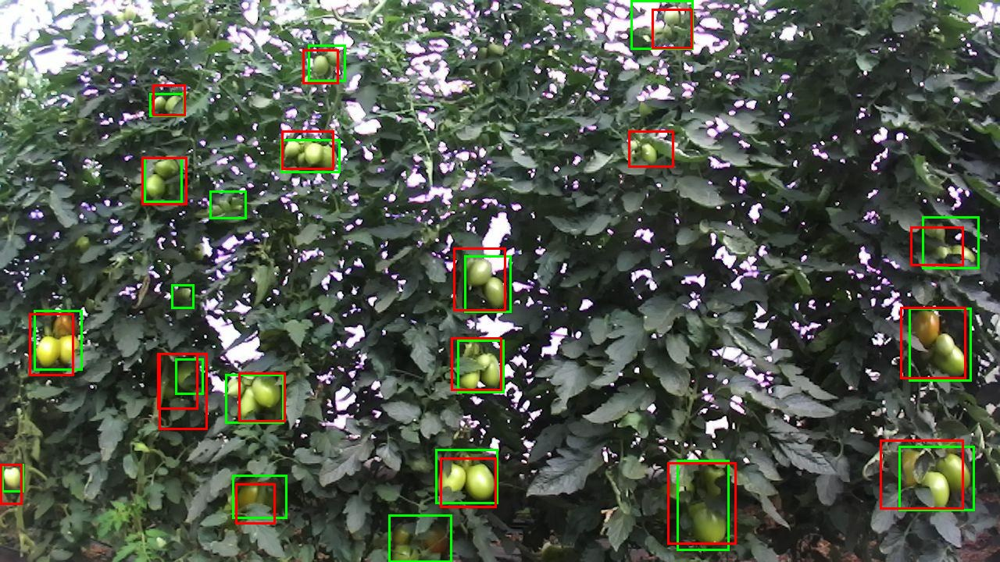
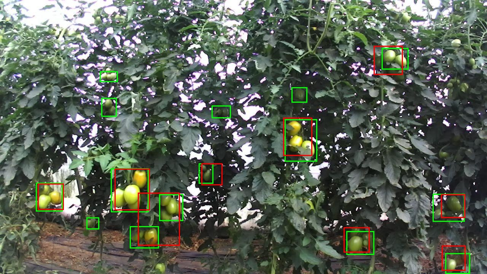
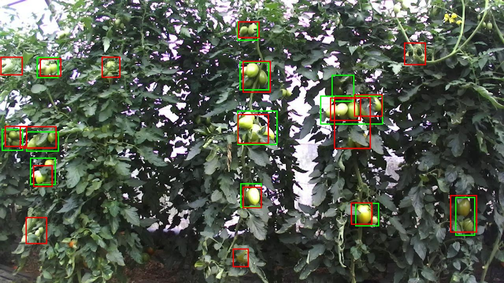
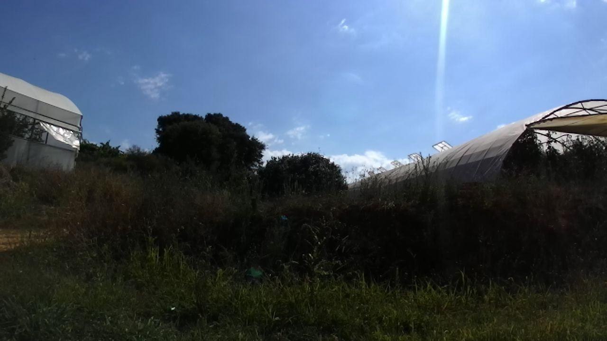

# Full AgRob cluster annotations: V2 run — 9 October 2026

## Team summary

The completed Roboflow export contains **449 images / 2,985 cluster boxes**. We trained a new one-class cluster DETR on **360 training images**, selected confidence **0.90** on **44 validation images**, then evaluated **45 supplied test images**. Test count MAE is **1.933 clusters/image**, signed error is **-1.356**, box precision is **79.2%**, and recall is **66.6%**.

The same **44 previously reviewed test frames**, with unchanged labels, have V2 MAE **1.977**, compared with V1 **2.341**. The extra V2 test image is labeled empty. This is a reused development benchmark, not a fresh scene-independent final test. There are **275 nearby-frame pairs across the supplied splits**.

## Dataset and import audit

Source: `tomato cluster.v2i.coco.zip`, full user-labeled Roboflow export of AgRobTomato.

Archive SHA256: `94da4e8c43fd494b7e4f7841508d8c6a9c43180e9e5905b7197456537f73cf19`.

| Split | Images | Cluster boxes | Images labeled with zero clusters |
| --- | ---: | ---: | ---: |
| Training | 360 | 2,294 | 15 |
| Validation | 44 | 308 | 3 |
| Supplied test | 45 | 383 | 1 |
| Total | 449 | 2,985 | 19 |

All images are 1280 × 720. The importer validated image dimensions, annotation references, positive finite boxes, duplicate names, and cross-split exact image hashes. The unused `tomato-final` parent category was removed; source `tomato cluster` became model category `tomato_cluster` with ID 0.

One training box (annotation 2237, Barroselas 0163) extended **0.01 pixel** beyond the right edge. Its width was clipped from 34.55 to 34.54 pixels in prepared labels. The original ZIP was preserved. [The manifest](agrob_cluster_v2_manifest.json) records both coordinates. The importer now allows and records at most 0.02-pixel border-rounding overshoots and rejects larger errors. No cluster labels or group membership were changed.

Training and validation contact sheets were visually checked before model evaluation; this was not a full independent annotation audit. Zero-cluster counts reflect the completed export; empty scenes were not independently audited.

All 116 V1 images keep **identical box labels and split assignments** in V2. The full export adds 306 training, 26 validation, and 1 test image. No exact duplicate source images were found across V2 splits. Nearby-frame pairs cross splits: 136 train/test, 119 train/validation, 20 test/validation. See [version audit](results/agrob_clusters_v2/version_audit.json).

The label means **visually grouped nearby tomatoes that appear to share one stem**. Botanical same-stem membership is unverified. These scores measure cluster boxes, not individual tomatoes or verified trusses.

## Training and selection

- Initializer: `MohamedKhayat/fruit-detector-detr-50`, revision `19d09855a284cf040460c1ac39fe994e400cdf47`.
- A newly initialized one-class cluster head replaced the fruit head. Neither the V1 local cluster checkpoint nor the locally fine-tuned fruit checkpoint initialized this run.
- NVIDIA RTX 3070, 8 GB; existing `.venv-gpu`; PyTorch 2.14.1+cu130, Transformers 4.57.6.
- 15 epochs, seed 42, resize within 480 × 480 with aspect ratio preserved, dynamic padding, batch 1, gradient accumulation 2.
- AdamW, main learning rate 5e-5, backbone 1e-5, weight decay 1e-4, gradient clipping 1.0; no augmentation.
- Best checkpoint: epoch **14**, lowest validation loss **0.929937**. Training box-geometry check passed; all 15 epochs completed with finite losses.
- Validation confidence sweep: 0.10 through 0.90 in steps of 0.10, then 0.95 and 0.99. Lowest validation count MAE selects the threshold, with box F1 breaking ties.
- Frozen confidence: **0.90**, recorded at `2026-10-09T10:31:57.569495+00:00` before test scoring. Test used this single threshold without tuning.

Checkpoint: `outputs/agrob-cluster-detr-v2-480/best_model/`.

`model.safetensors` SHA256: `e919e0256988359b0a50a79ba7430b2618ec073adef181507d034b91d7eb53fb`.

## Recorded results

| Metric at confidence 0.90 | Validation | Supplied test |
| --- | ---: | ---: |
| Images | 44 | 45 |
| Labeled clusters | 308 | 383 |
| Predicted clusters | 335 | 322 |
| Mean absolute count error | 1.523 | 1.933 |
| Mean signed count error | 0.614 | -1.356 |
| Exact count images | 17 | 8 |
| Matched boxes at IoU 0.50 | 221 | 255 |
| Unmatched labeled boxes | 87 | 128 |
| Unmatched predicted boxes | 114 | 67 |
| Box precision | 65.97% | 79.19% |
| Box recall | 71.75% | 66.58% |
| Box F1 | 68.74% | 72.34% |

MAE averages `abs(predicted count − labeled count)` per image. Signed error averages `predicted − labeled`; negative means undercounting. Box precision/recall use one-to-one matching at IoU 0.50. They are fixed-threshold box metrics, not COCO mAP. Unmatched predictions can reflect duplicate/split detections, poor boundaries, or label omissions.

### Comparison on the same 44 frames

| Measure | V1: 54 training images | V2: 360 training images |
| --- | ---: | ---: |
| Validation-selected threshold | 0.90 | 0.90 |
| Count MAE, clusters/image | 2.341 | 1.977 |
| Signed count error | -1.523 | -1.386 |
| Box precision | 49.7% | 79.2% |
| Box recall | 41.0% | 66.6% |

Image identities and labels are identical in this comparison. Each run uses its own validation-selected confidence and checkpoint; the expanded training and validation data are the experiment change. These frames were previously inspected, and nearby scenes cross splits, so the comparison supports development findings rather than an independent accuracy claim. [Comparison data](results/agrob_clusters_v2/common_test_comparison.json).

## Inspected V2 examples

Green boxes are supplied labels; red boxes are model predictions. The following selected examples were inspected after fixed-threshold scoring. They illustrate behavior, without measuring each error type's prevalence.

### Barroselas 0083

V2 matches 15 of the 20 labeled groups here, versus 11 for V1. The count is closer (19 predictions versus V1 11), but five labels are unmatched and four predictions are extra. Small shaded and edge groups still need attention; a close total does not mean every group is correct.

Labels: 20; predictions: 19; matched: 15.



### Barroselas 0044

Several small partly hidden labeled groups in the upper half are missed. Larger clear groups are often detected, but some red boxes cover only part of a labeled group or extend beyond it. This image has 15 labels, nine predictions, and five matched boxes.

Labels: 15; predictions: 9; matched: 5.



### Barroselas 0119

Several red boxes overlap or divide the right-hand labeled group. Other predictions are outside supplied boxes, so label completeness should also be checked. There are 12 labels, 18 predictions, and 10 matched boxes; this is the largest positive count error in the supplied test set.

Labels: 12; predictions: 18; matched: 10.



### Empty-scene frame 0150

This exported test image has no cluster labels and the model returns zero predictions. The preview shows an outdoor scene between greenhouses. One empty test example is insufficient to establish false-alarm performance.

Labels: 0; predictions: 0; matched: 0.



[Per-image test counts](results/agrob_clusters_v2/test_counts.csv), [validation sweep](results/agrob_clusters_v2/validation_thresholds.csv), [manual example review](results/agrob_clusters_v2/error_review.csv), and [ranked count errors](results/agrob_clusters_v2/worst_test_images.csv) are tracked. Full predictions and previews remain in ignored `outputs/` folders.

## Reproduce or use the model

Run from the repository in PowerShell. Use new dataset/manifest/output paths for each replay. These offline flags work here because the pinned source checkpoint is cached; a new machine needs its initial source-model download.

```powershell
.\.venv-gpu\Scripts\python.exe prepare_agrob_clusters.py --archive "..\tomato cluster.v2i.coco.zip" --output data\agrob_clusters_v2_replay --manifest agrob_cluster_v2_replay_manifest.json
$env:HF_HUB_OFFLINE = '1'
$env:TRANSFORMERS_OFFLINE = '1'
.\.venv-gpu\Scripts\python.exe finetune_agrob_fruit.py train --class-name tomato_cluster --prepared data\agrob_clusters_v2_replay --images-dir data\agrob_clusters_v2_replay\images --output outputs\agrob-cluster-v2-replay --epochs 15 --image-size 480 --batch-size 1 --grad-accum 2 --seed 42
.\.venv-gpu\Scripts\python.exe finetune_agrob_fruit.py evaluate --class-name tomato_cluster --prepared data\agrob_clusters_v2_replay --images-dir data\agrob_clusters_v2_replay\images --checkpoint outputs\agrob-cluster-v2-replay\best_model --split valid --output outputs\agrob-cluster-v2-replay-valid
```

Record that run's selected threshold and checkpoint hash before scoring its test split. For this saved V2 checkpoint, the fixed setting is 0.90:

```powershell
.\.venv-gpu\Scripts\python.exe finetune_agrob_fruit.py evaluate --class-name tomato_cluster --prepared data\agrob_clusters_v2 --images-dir data\agrob_clusters_v2\images --checkpoint outputs\agrob-cluster-detr-v2-480\best_model --split test --thresholds 0.9 --output outputs\agrob-cluster-v2-test-replay
.\.venv-gpu\Scripts\python.exe count_clusters.py --images "C:\path\to\photo.jpg" --checkpoint outputs\agrob-cluster-detr-v2-480\best_model --threshold 0.9 --output outputs\cluster-photo-v2
.\.venv-gpu\Scripts\python.exe build_team_dashboard.py
```

## Present and adjust next

Open [the standalone dashboard](presentation/tomato_findings_dashboard.html). Its current cluster metrics and reviewed examples are V2, with V1 retained as history. Individual-fruit results are unchanged: 4.375 fruit/image development MAE and a previously viewed benchmark. [Updated speaking bullets](presentation/PRESENTATION_WALKTHROUGH.md) walk through the sequence.

1. Confirm the completed labeling rules for singletons, partial groups, edges, and unclear stems.
2. Review the new failure examples and empty-image annotations. Version actual corrections rather than silently altering the completed source export.
3. Reserve genuinely new scenes and keep nearby video frames/plants together across splits. The current 45 test images are development material after review.
4. Keep the V2 480-pixel run as the recorded baseline, then try 640-pixel input as a separate validation comparison. More resolution or training is a hypothesis, not a guaranteed improvement.
5. Freeze the chosen checkpoint and confidence before the fresh final test. Agree on an acceptable count-error target, then share count error, box scores, and common misses.

The dataset ZIP, weights, and full outputs are ignored by Git. Small results, source manifests, reviewed examples, the dashboard, and the presentation guide are tracked. A local V2 checkpoint handoff ZIP is `outputs/agrob-cluster-detr-v2-480-handoff.zip`.
